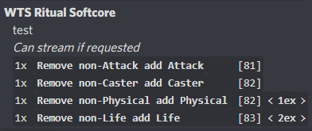
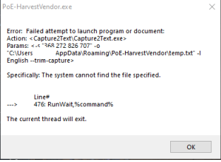

# PoE-HarvestVendor
```diff
- I highly suggest also checking out Stregons Fork, he improved and added a lot of things. 
```
[https://github.com/Stregon/PoE-HarvestVendor](https://github.com/Stregon/PoE-HarvestVendor)

## A little status update (15.7.2021)
- i think the tool as envisioned now is essentially feature complete
    - adding things like WTB section, or tech like sorting would require major reworks and rethinking both visually and technically
- the last thing i want to do before i call this 1.0 release is figure out how to properly handle scaling of the GUI on big resolution screens
    - problem is, as of now, i don't have the time for it or a clue how to do it properly

- i will still keep fixing bugs and updating to keep it in line with any harvest changes

```diff
- Only works if PoE is in WINDOWED / WINDOWED BORDERLESS mode, doesnt work in Fullscreen

- Bigger resolution = more fucked up UI design because i don't know how to handle windows display scaling properly.
```
# [DOWNLOAD HERE](https://github.com/esge/PoE-HarvestVendor/releases/latest)

# [HOW TO USE - YT video](https://www.youtube.com/watch?v=l2syzeQ0YZQ)

⚠️ It's a BETA there will be issues and lacking features :)

- Convert your Horticrafting station crafts into a post, almost in a smart way
- Using AHK to call Capture2Text OCR tool on selected screen region
- Then parsing the text
- It works as long as OCR doesn't do stupid stuff

## FIRST TIME INSTALL
1. click on DOWNLOAD HERE up there ^ it takes you to the latest releases
2. get the ahk or exe zip thats marked First_Install
3. unpack it, it contains all neccessary stuff:
    - capture2text
    - resources folder
    - the tool itself (harvestVendor ahk or exe)

4. Run HarvestVendor `.ahk`/`.exe` 🎉

- If you download the `.ahk` file:
    - Requires AHK 1.1.27+
    - link to current [AHK 1.1.33](https://www.autohotkey.com/download/ahk-install.exe)

## UPDATING
- just get the new HarvestVendor file from the DONWLOAD HERE link, replace the existing and reload

## HOW TO USE
- Default Hotkeys:
    - CTRL + SHIFT + G - opens GUI
    - CTRL + G - starts scan

- When you start scan, Drag select area with the craft text  


- wait a moment and crafts will be loaded into the UI
- set prices if you wish
- select your league and so on
- click Create Posting for the section you wish to
- now you have a Discord formatted message in clipboard  


## Settings
- if you game on monitor thats not primary in windows you can change it in settings
- if you use display scaling in wodnwos, you need to change it in settings
- if you don't like the default keys, surprise, you can change them in settings

## List of features
- Uses OCR to identify crafts from Horticrafting station
- Option to rescan last scanned area
- Counts crafts if there are multiple of the same
- Sorts them into groups based on TFT Discord rules
- Allows to set prices for crafts
- Line of custom text (be careful to not write anything that triggers the discord bot)
- Checkbox "Can Stream"
- box for IGN if you want to add that to the post
- Generates formatted discord post
- Remembers prices
- Remembers loaded crafts
- Outputs Log.csv of sold crafts (entry triggered by Shift+click on the rows delete button)

## FAQ
**Q. Why does it show lv00?**  
A. If its unable to read the level it says lv00. You can try delete the craft and rescan it. Or fix the level manualy.

**Q. I'm getting error about "WinInet-something"**  
A. This one?  
  
Get curl binary from [here](https://curl.se/windows/), extract curl.exe from archive and put in into directory with ahk script. Script now will use this tool for version checking.

**Q. A craft i have in horticrafting station is not showing up in the result**  
A. There are 2 possible reasons:
  1. text recognition was too messed up and i couldn't recognize the craft  
    - Solution: Run the scan again and select only that one craft
  2. I arbitrarily decided its not worth to list that one, if you want it listed, contact me or open an issue. [List of ignored crafts](https://github.com/esge/PoE-HarvestVendor/wiki/Crafts-that-are-being-ignored)

**Q. Help! When I try and take a screenshot, I get the following error about finding a file:**
  

A. The most likely cause for this is that your folder structure containing Capture2Text is incorrect, and you may have an additional folder. Please ensure that your folder structure looks like:

```
|--> Poe-HarvestVendor
|----> Capture2Text
|-------->  *files for the software, NOT another folder*
|----> PoeHarvestVendor.exe
```

and does NOT look like:

```
|--> Poe-HarvestVendor
|----> Capture2Text
|--------> Capture2Text
|--------> *files for the software, NOT another folder*
|----> PoeHarvestVendor.exe
```

Once you've sorted out the folder structure, try restarting the application to see if it now works.

## Used libraries
- http://capture2text.sourceforge.net/ for OCR
- https://github.com/cocobelgica/AutoHotkey-JSON jxon function embeded in the main file

---
### If you got all the way here and want to throw some beer money my way
[PayPal.me link](https://www.paypal.com/paypalme/Esge1)
