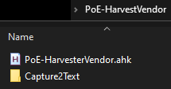
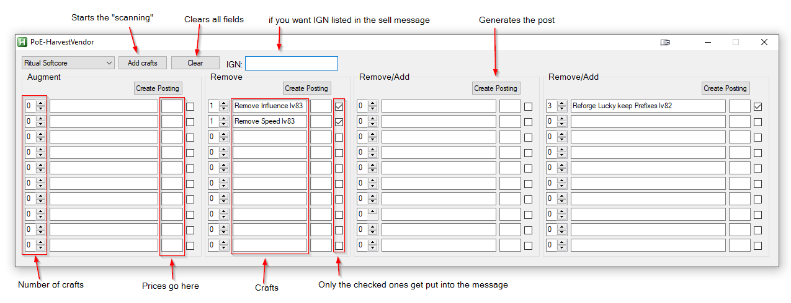
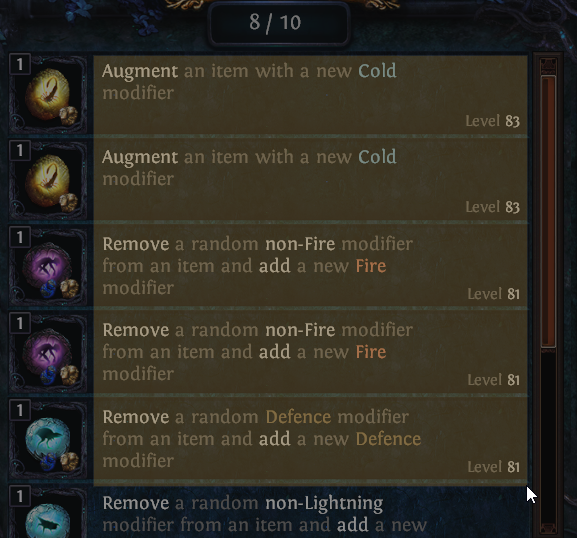
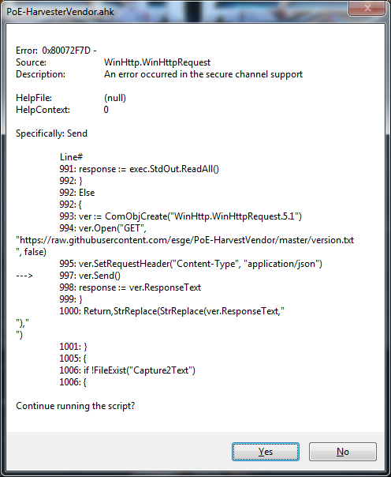

# PoE-HarvestVendor

```diff
- Only works if PoE is in WINDOWED / WINDOWED BORDERLESS mode, doesnt work in Fullscreen
```
# [DOWNLOAD HERE](https://github.com/esge/PoE-HarvestVendor/releases/latest)

⚠️ It's a BETA there will be issues and lacking features :)

- Convert your Horticrafting station crafts into a post, almost in a smart way
- Using AHK to call Capture2Text OCR tool on selected screen region
- Then parsing the text
- It works as long as OCR doesn't do stupid stuff

## Known quirks
 - Text recognition sometimes confuses 8, 3 and 6 
    - you'll have to adjust craft levels and counts if affected yourself in this case

## Getting started

 - If you download the `.ahk` file:
    - Requires AHK 1.1.27+
    - link to current [AHK 1.1.33](https://www.autohotkey.com/download/ahk-install.exe)
<!-- Commenting this becuase this might be fixed with the change from switch case to IFs
 Requires [AHK 1.1.33.02](https://www.autohotkey.com/download/ahk-install.exe)
   - not that it wont work on older, but there was a bug where it would say that a piece  of code is unreachable in a switch/case and you will get a warning popup everytime you launch it
    - the error message it shows on older versions is:

```
Warning: This line will never execute, due to Return precceding it
```
or
```
Line Text: switch group {
Error: This line does not contain a recognized action
```
-->
- Download last release of Capture2Text: https://sourceforge.net/projects/capture2text/files/Capture2Text/
- Download last release: https://github.com/esge/PoE-HarvestVendor/releases/latest
- Create a new folder with the `.ahk` script or the `.exe` file (depending on what you donwloaded)
- Extract the Capture2Text archive in that same folder  
      
- Run `.ahk`/`.exe` script 🎉

## Usage

- To start extracting your Horticrafts you have to press: **CTRL + SHIFT + G**

  (You can also start capture directly without using window by using: **CTRL + G**)
- The tool window will appear, you have to select your league, add your IGN(optional), then start the scanning
  

- After clicking on "Add crafts", you have to drag from the top left corner of your craft to the bottom right. Here is
  the recommended area to select:
  

- You now have to set all prices for your crafts
- Then you can click on "Create Posting" buttons to copy your selling message, here is an example:
```
WTS Ritual Softcore 
  1x Remove Influence lv83 - 100c
  2x Remove Speed lv83 - 2ex
```

# FAQ
**Q. A craft i have in horticrafting station is not showing up in the result**  
A. There are 2 possible reasons:
  1. text recognition was too messed up and i couldn't recognize the craft  
    - Solution: Run the scan again and select only that one craft
  2. I arbitrarily decided its not worth to list that one, if you want it listed, contact me or open an issue. [List of ignored crafts](https://github.com/esge/PoE-HarvestVendor/wiki/Crafts-that-are-being-ignored)

**Q. I'm getting error about "WinInet-something"**  
A. This one?  
  
Get curl binary from [here](https://curl.se/windows/), extract curl.exe from archive and put in into directory with ahk script. Script now will use this tool for version checking.

## Used libraries

- http://capture2text.sourceforge.net/ for OCR
- https://github.com/cocobelgica/AutoHotkey-JSON jxon function embeded in the main file

---
### If you got all the way here and want to throw some beer money my way
[PayPal.me link](paypal.me/Esge1)