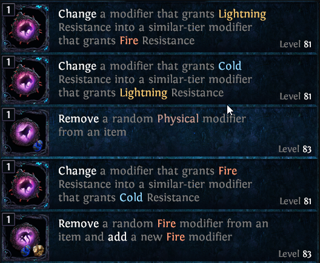

# PoE-HarvestVendor
 - uses AHK to call the http://capture2text.sourceforge.net/ OCR tool on a specific region
 - Trims OCR-ed text to just the basic stuff (Augment a Magic or Rare item with a new Caster modifier -> Augment Caster)
 - puts the result into clipboard (for now, later maybe some gui to add prices and other info to it and then clipboard)
 
# Install
  - get the above mantioned OCR tool (tested on version 4.6.2)
  - get the .ahk file
  - put them in the same Folder  
    Folder:
      - Capture2text
      - PoE-harvestVendor.ahk
      
# Use
  - open horticrafting station
  - use the harvestVendor hotkey (TDB for now ctrl+shift+q)
  - select the area with text (the left side icons mess up OCR)
  - you should have stuff in clipboard now
  

-->  
Change Lightning Resistance into Fire Resistance  
Change Cold Resistance into Lightning Resistance   
Remove Physical V ~ ‘   
Change Fire Resistance into Cold Resistance   
Remove Fire add Fire   

- As you can see occasionally there is a stray letter or symbol, thats an issue of the OCR tool, can't really do much with it
